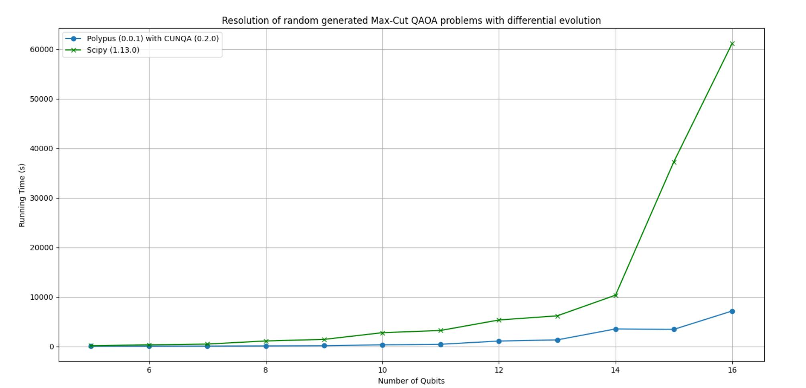

<p align="center">
  
</p>


# Polypus
Polypus is a distributed quantum computing library designed to optimize the execution of quantum algorithms by distributing computation across available hardware resources. The core of the library is written in Rust, while Python bindings are provided to make it more accessible to a broader range of users.

## How to use Polypus?
*Polypus is a library currently under development* 

**Instalation**

First, build the polypus-python package:

*If cunqa is not available comment this line in packages/polypus_python/polypus_python/running_functions.py*

```python
from cunqa import getQPUs, gather
```

```python
python -m build packages/polypus_python/
```

Next, install the package:

```python
pip install packages/polypus_python/
```

Finally, build Polypus

```bash
maturin develop --release
```

**CUNQA**

To instal cunqa please refer to cunqa github.

**Examples**

Check the *examples* section for complete running examples.

**Run a Quantum Circuit**

We just need to Polypus the Quantum Circuit, the number of shots and the infraestructure *(qmio if cunqa is available)*
```python
result = polypus.run_quantum_circuit(qft_circuit, shots=1000, infraestructure="local")
```

**Run a Quantum Circuit and distribute shots**

We can distribute the Quantum Circuit shots to reduce the running time. We just need to specify the number of qpus. *(Set infraestructure to qmio if cunqa is available)*
```python
result = polypus.run_quantum_circuit(qft_circuit, shots=1000, infraestructure="local",  n_qpus=10)
```

**Differential Evolution**

We can directly import an optimization algorithm. For example, if we define a QAOA circuit and specify how to compute its expectation value, we can optimize this circuit using differential evolution. Polypus takes care of optimizing the execution by distributing the shots across the available hardware resources.

```python
polypus.differential_evolution(
    qc=qc, 
    shots=N_SHOTS, 
    n_qpus = N_QPUS, 
    expectation_function=bitstring_to_obj, 
    generations=MAX_GENERATIONS, 
    population_size=POPULATION_SIZE, 
    dimensions=2*layers, 
    infraestructure="qmio", 
    id=id,
    tolerance=TOL,
    nodes=N)
```

If cunqa is not available, set **infraestructure="local"**

## Performance
As an initial validation, we conducted a performance comparison on solving various randomly generated Max-Cut problems across different qubit counts using differential evolution. We measured and compared the execution time of Polypus against Scipy. While *more comprehensive evaluations and benchmarking are planned for the near future*, the preliminary results are very promising, as illustrated in the following chart.

<p align="center">
  
</p>

## Credits
- Diego Beltrán Fernández Prada
- Víctor Sóñora Pombo 
- Sergio Figueiras Gómez
- Miguel Boubeta Martínez
- Galicia Supercomputing Center (CESGA)

## Dependencies
Polypus relies on the following Python Packages:
- matplotlib==3.10.3
- networkx==3.2.1
- numpy==2.2.6
- qiskit==2.0.1
- qiskit_aer==0.17.0
- cunqa==0.2.0

## License
Polypus is **Licensed under the EUPL**. Check the *License.txt* file for more details.