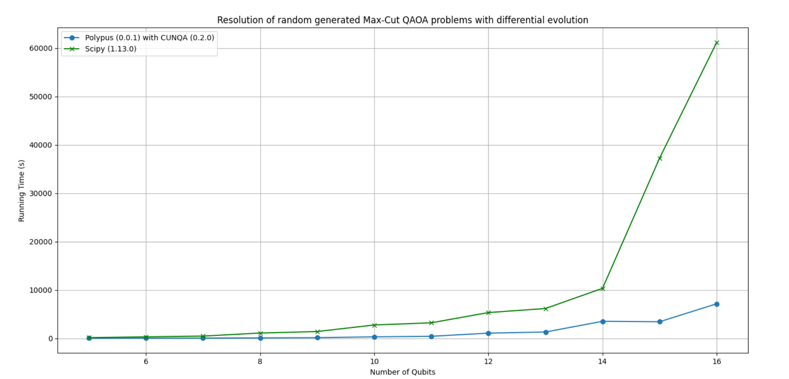

<p align="center">
  
</p>


# Polypus
Polypus is an open-source distributed quantum computing library designed to optimize the execution of quantum algorithms by distributing computation across available hardware resources. The core of the library is written in Rust, while Python bindings are provided to make it more accessible to a broader range of users.

## How to use Polypus?
*Polypus is a library currently under development* 

**Instalation**

First, build the polypus-python package:

```python
python -m build packages/polypus_python/
```

Next, install the package:

```python
pip install packages/polypus_python/
```

Finally, build Polypus

```bash
maturin develop --release
```

**CUNQA**

To instal cunqa please refer to cunqa github.

**Examples**

Check the *examples* section for complete running examples.

**Run a Quantum Circuit**

We just need to send to Polypus the Quantum Circuit, the number of shots, the infraestructure and the number of qpus:
```python
result = polypus.run_quantum_circuit(qc, shots=NUM_SHOTS, infrastructure=INFRASTRUCTURE, n_qpus=1)
```

**Run a Quantum Circuit and distribute shots**
We can distribute the Quantum Circuit shots to reduce the running time. We just need to specify the number of qpus. 
```python
result = polypus.run_quantum_circuit(qc, shots=NUM_SHOTS, infrastructure=INFRASTRUCTURE, n_qpus=10)
```

## Algorithms
We can directly import an optimization algorithm. Polypus takes care of optimizing the execution by distributing the inviduals of the population across the available hardware resources. For example, if we define a QAOA circuit and specify how to compute its expectation value. We can optimize this circuit using differential evolution, PSO or Quantum Natural Gradient

If cunqa is not available, set **infraestructure="local"**

### Differential Evolution

```python
result_params = polypus.differential_evolution(
    qc=qc,
    shots=N_SHOTS,
    n_qpus=N_QPUS,
    expectation_function=bitstring_to_obj,
    generations=MAX_GENERATIONS,
    population_size=POPULATION_SIZE,
    dimensions=2 * layers,
    infrastructure=infrastructure,
    id=id,
    tolerance=TOL,
    nodes=NUM_NODES,
    cores_per_qpu=CORES_PER_QPU
)
```

### PSO

```python
result_params = polypus.particle_swarm_optimization(
    qc=qc,
    shots=N_SHOTS,
    n_qpus=N_QPUS,
    expectation_function=bitstring_to_obj,
    generations=MAX_GENERATIONS,
    population_size=POPULATION_SIZE,
    dimensions=2 * layers,
    bounds=(0.0, np.pi),
    infrastructure=infrastructure,
    id=id,
    tolerance=TOL,
    nodes=NUM_NODES,
    cores_per_qpu=CORES_PER_QPU
)
```

### QNG

As default parameters we can use:

- QNG_LEARNING_RATE = 0.1

- QNG_STEP_SIZE     = 0.1

- QNG_TIKHONOV_REG  = 0.05

```python
result_params = polypus.quantum_natural_gradient(
    qc=qc_qng,
    shots=N_SHOTS,
    n_qpus=N_QPUS,
    expectation_function=bitstring_to_obj,
    variance_function=variance_fn,
    max_iters=MAX_GENERATIONS,
    dimensions=2 * layers,
    bounds=(0.0, np.pi),
    infrastructure=infrastructure,
    id=id,
    learning_rate=QNG_LEARNING_RATE,
    finite_difference_step=QNG_STEP_SIZE,
    tikhonov_reg=QNG_TIKHONOV_REG,
    nodes=NUM_NODES,
    cores_per_qpu=CORES_PER_QPU
)
```

## Performance
As an initial validation, we conducted a performance comparison on solving various randomly generated Max-Cut problems across different qubit counts using differential evolution. We measured and compared the execution time of Polypus against Scipy. While *more comprehensive evaluations and benchmarking are planned for the near future*, the preliminary results are very promising, as illustrated in the following chart.

<p align="center">
  
</p>

## Credits
- Diego Beltrán Fernández Prada
- Víctor Sóñora Pombo 
- Sergio Figueiras Gómez
- Miguel Boubeta Martínez
- Galicia Supercomputing Center (CESGA)

## Dependencies
Polypus relies on the following Python Packages:
- matplotlib==3.10.3
- networkx==3.2.1
- numpy==2.2.6
- qiskit==2.0.1
- qiskit_aer==0.17.0
- cunqa==2.3.0

## License
Polypus is **Licensed under the EUPL**. Check the *License.txt* file for more details.