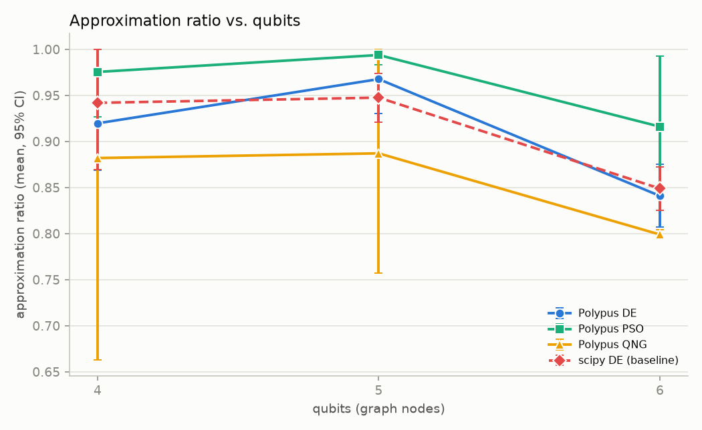
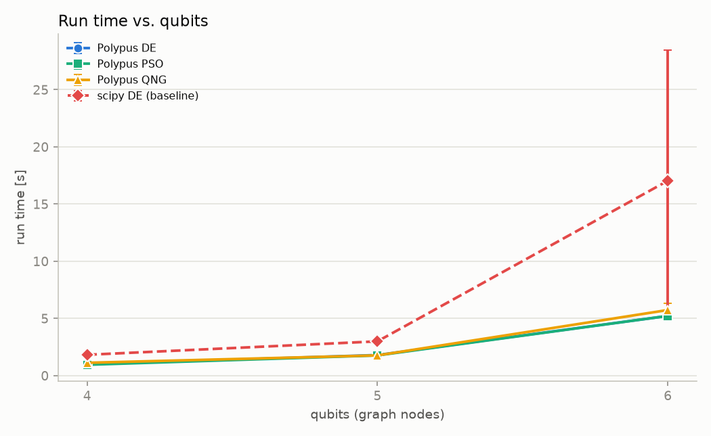
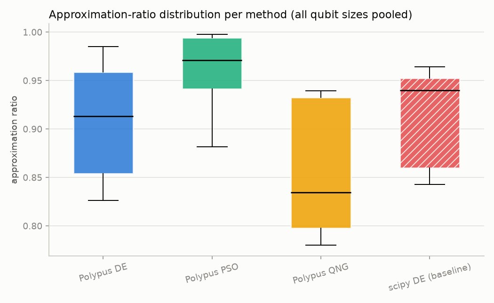
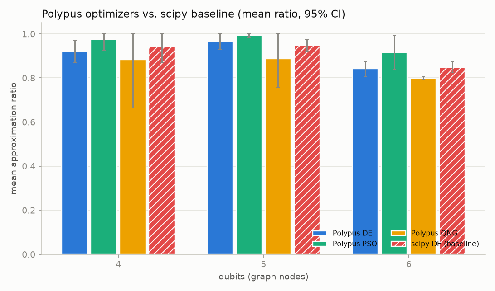

# MaxCut–QAOA experiment report

## What this experiment demonstrates

MaxCut is optimised with QAOA on a local statevector/Aer simulator, comparing three Polypus optimizers (**DE**, **PSO**, **QNG**) against a pure-scipy `differential_evolution` baseline ("no Polypus"). Each cell below is the aggregate of several independent repetitions, so the numbers carry a spread, not a single lucky/unlucky run.

## Reproducibility

The whole sweep is reproducible from a single base seed. Repetition *r* of every (qubits, method) uses `seed = base_seed + r`, and every source of shot randomness (training oracle, QNG variance callback, final evaluation, scipy's Aer sampling) is seeded from it — so two runs with the same seed produce the identical approximation ratio and best bitstring. This report's data used base seed(s) **42**. Regenerate the data with:

```bash
python examples/max_cut/sweep_maxcut.py --qubits 4 5 6 --repeats 3 --seed 42
python examples/max_cut/report_maxcut.py
```

## How to read the metrics table

One row per (method, qubit count). `ratio mean` is the primary quality metric (expected cut ÷ optimal cut, so 1.0 is perfect); the 95% CI is a t-interval over the `n` repetitions. `time` columns are wall-clock seconds per run. Higher ratio is better; lower time is better.

> The CI shown is a 95% t-interval **clipped to each metric's physical range** (ratio to `[0, 1]`, time to `[0, ∞)`). With few repetitions the raw t-interval can extend past those bounds; the mean and standard deviation are the unmodified sample values — only the displayed interval (and its error bars) is clamped.

## Headline

At 6 qubits, the best Polypus optimizer (**Polypus PSO**) reached a mean approximation ratio of **0.9160**, 0.0672 above the scipy baseline (0.8488), with a mean run time of 5.21s vs scipy's 17.03s (≈3.27× time ratio).

## Provenance

- runs: **36** | qubits: [4, 5, 6] | methods: ['Polypus DE', 'Polypus PSO', 'Polypus QNG', 'scipy DE (baseline)']
- repeats: 3 | base seed(s): [42] | shots: [4000]
- git commit(s): ['451e0fd'] | polypus: ['0.6.0']
- timestamps: 2026-07-14T12:23:08Z … 2026-07-14T12:25:38Z

## Metrics

| method | qubits | n | ratio mean | ratio std | ratio median | ratio min | ratio max | ratio 95% CI | time mean [s] | time std [s] | time 95% CI [s] |
| --- | --- | --- | --- | --- | --- | --- | --- | --- | --- | --- | --- |
| Polypus DE | 4 | 3 | 0.9195 | 0.0204 | 0.9130 | 0.9032 | 0.9424 | [0.8688, 0.9703] | 0.987 | 0.017 | [0.945, 1.030] |
| Polypus DE | 5 | 3 | 0.9675 | 0.0152 | 0.9588 | 0.9588 | 0.9850 | [0.9299, 1.0000] | 1.790 | 0.018 | [1.744, 1.836] |
| Polypus DE | 6 | 3 | 0.8408 | 0.0137 | 0.8424 | 0.8264 | 0.8536 | [0.8067, 0.8748] | 5.209 | 0.015 | [5.172, 5.246] |
| Polypus PSO | 4 | 3 | 0.9753 | 0.0196 | 0.9708 | 0.9583 | 0.9968 | [0.9265, 1.0000] | 0.938 | 0.012 | [0.909, 0.966] |
| Polypus PSO | 5 | 3 | 0.9937 | 0.0042 | 0.9941 | 0.9893 | 0.9977 | [0.9831, 1.0000] | 1.756 | 0.016 | [1.716, 1.796] |
| Polypus PSO | 6 | 3 | 0.9160 | 0.0309 | 0.9248 | 0.8816 | 0.9415 | [0.8392, 0.9927] | 5.209 | 0.027 | [5.143, 5.275] |
| Polypus QNG | 4 | 3 | 0.8819 | 0.0883 | 0.9324 | 0.7799 | 0.9333 | [0.6625, 1.0000] | 1.111 | 0.085 | [0.900, 1.323] |
| Polypus QNG | 5 | 3 | 0.8869 | 0.0523 | 0.8869 | 0.8347 | 0.9393 | [0.7570, 1.0000] | 1.758 | 0.023 | [1.699, 1.816] |
| Polypus QNG | 6 | 3 | 0.7989 | 0.0021 | 0.7977 | 0.7976 | 0.8013 | [0.7937, 0.8041] | 5.724 | 0.228 | [5.158, 6.290] |
| scipy DE (baseline) | 4 | 3 | 0.9418 | 0.0292 | 0.9523 | 0.9087 | 0.9643 | [0.8692, 1.0000] | 1.811 | 0.015 | [1.775, 1.848] |
| scipy DE (baseline) | 5 | 3 | 0.9474 | 0.0106 | 0.9428 | 0.9400 | 0.9596 | [0.9211, 0.9738] | 2.986 | 0.011 | [2.959, 3.013] |
| scipy DE (baseline) | 6 | 3 | 0.8488 | 0.0096 | 0.8436 | 0.8429 | 0.8598 | [0.8250, 0.8725] | 17.026 | 4.607 | [5.581, 28.470] |

## Figures

### Approximation ratio vs. qubits



### Run time vs. qubits



### Approximation-ratio distribution per method



### Polypus vs. scipy baseline



